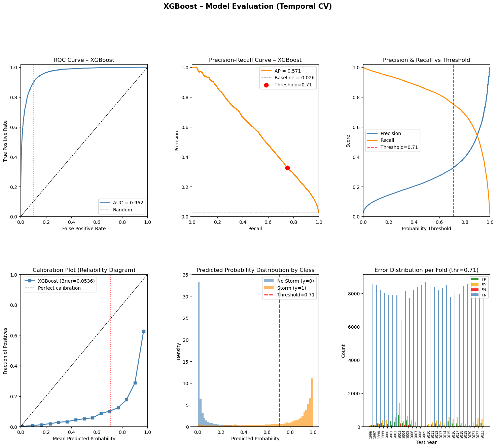

# spring-2026-electromagnetic-risk-prediction
Team project: spring-2026-electromagnetic-risk-prediction

## Overview
Geomagnetic storms driven by solar activity pose risks to power grids, satellites, and communication systems. In this project, we developed a data-driven solar-to-ground proxy model that predicts near-term geomagnetic activity using solar wind data. The final model is an XGBoost Classifier tuned to maximize correctly predicting when a storm occurs subject to keeping the false positive rate at an acceptable level. This trade-off makes the model useful as an "early warning" indicator so operators can maintain a higher alertness to prepare for mitigation measures. To read more about possible impacts of and mitigation measures for geomagnetic storms, see this [Wikipedia overview](https://en.wikipedia.org/wiki/Geomagnetic_storm#Impacts).

**Core Question:** Can we predict geomagnetic storms ($K_p \geq 5.0$) with using solar wind observations from NASA and NOAA? See `kpis.md` for details.

See `src/notebooks/final_results.ipynb` for final model training and evaluation.

## Summary of results
We provide a cross-validated XGBoost classifier trained on historical NASA data. 
The model provides an approximately 45 minute prediction from solar wind data received by the NASA DSCOVR space weather station, located between the Earth and the Sun at the L1 Lagrange point, approximately 1.5 million kilometers from Earth.

We produce the following chart of results in `src/notebooks/final_results.ipynb`.

## Notebooks
We include the following notebooks giving an overview of the data exploration, feature seleciton, and model selection processes.

- **Final results / end-to-end modeling:** `notebooks/final_results.ipynb`
- **Exploratory analysis:** `notebooks/eda.ipynb`
- **Baseline model:** `notebooks/baseline.ipynb`
- **Feature selection:** `notebooks/feature_selection.ipynb`
- **Model selection / comparison:** `notebooks/model_selection.ipynb`

## Repository Structure 
- `notebooks/` — analysis and modeling notebooks (main work happens here)
- `src/` — Python modules and scripts
  - `src/data/` — data ingestion + alignment utilities
  - `src/features/` — feature engineering code
  - `src/models/` — model code
- `data/` — datasets (often gitignored or partially tracked depending on size)
- `artifacts/` — saved outputs (figures, models, intermediate results)
- `presentation/` — slides / presentation material
- `kpis.md` — KPI definitions and what “success” means for this project
- `environment.yml` — reproducible conda environment

## Data Inventory & Provenance
| Source | Access Method | Frequency | License |
| :--- | :--- | :--- | :--- |
| **NASA OMNIWeb** | HTTPS/CSV (`src/data/fetch_nasa_omni_historical.py`) | Hourly (Historical) | Public Domain |
| **NOAA SWPC** | JSON API (Real-time stream) (`src/data/fetch_noaa_realtime.py`) | 1-Minute | Public Domain |

## Other models
- Note, the NOAA Space Weather Prediction Center provides real time space weather data and predictions at [https://www.swpc.noaa.gov/](https://www.swpc.noaa.gov/).
- [SpaceWeatherLive.com](https://www.spaceweatherlive.com/) aggregates solar weather data across various sources. Additionally, they have an app and it can be used to predict whether auroral activity might be visible in your area!